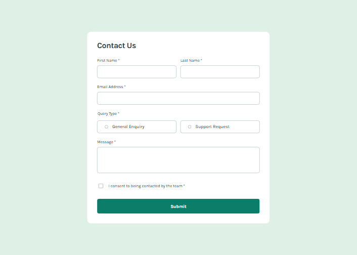

# Frontend Mentor - Contact form solution

This is a solution to the [Contact form challenge on Frontend Mentor](https://www.frontendmentor.io/challenges/contact-form--G-hYlqKJj). Frontend Mentor challenges help you improve your coding skills by building realistic projects.

## Table of contents

- [Overview](#overview)
  - [The challenge](#the-challenge)
  - [Screenshot](#screenshot)
  - [Links](#links)
- [My process](#my-process)
  - [Built with](#built-with)
  - [What I learned](#what-i-learned)
  - [Continued development](#continued-development)
  - [Useful resources](#useful-resources)
- [Author](#author)

## Overview

### The challenge

Users should be able to:

- Complete the form and see a success toast message upon successful submission
- Receive form validation messages if:
  - A required field has been missed
  - The email address is not formatted correctly
- Complete the form only using their keyboard
- Have inputs, error messages, and the success message announced on their screen reader
- View the optimal layout for the interface depending on their device's screen size
- See hover and focus states for all interactive elements on the page

### Screenshot



### Links

- Solution URL: [Github page](https://github.com/artemkotko14/contact-form)
- Live Site URL: [Webpage](https://artemkotko14.github.io/contact-form/)

## My process

### Built with

- Semantic HTML5 markup
- Flexbox
- SASS
- Mobile-first workflow

### What I learned

```css
background:
      linear-gradient(rgba(0, 0, 0, 0.5), rgba(0, 0, 0, 0.5)), $green-600;
}
```

This creates two background layers:

1. `linear-gradient(rgba(0, 0, 0, 0.5), rgba(0, 0, 0, 0.5))`

- A semi-transparent black layer (50% opacity).
- Because the start and end colors are the same, it doesn't actually look like a gradient—it acts as a dark overlay.

2. `$green-600`
   The solid green background underneath.

The result is that the button keeps its green color but appears darker, which is a common hover effect. It's similar to placing a translucent black sheet on top of the green background.

`input.validity.valid` is a built-in JavaScript property that checks whether an input passes all of its HTML validation rules. It returns `true` if the field is valid and `false` if it violates any constraints, such as being empty when required is present, having an invalid email format, or not matching a specified pattern. This makes it a simple way to determine whether a form field contains acceptable input.

`window.scrollTo()` is a JavaScript method that scrolls the page to a specific position. In this project, it is used to automatically move the user's view to the top of the page when the success message appears, ensuring that important feedback is immediately visible. By using behavior: "smooth", the page scrolls gradually instead of jumping instantly, creating a better user experience

```js
window.scrollTo({
  top: 0,
  behavior: "smooth",
});
```

`aria-atomic="true"` tells screen readers to announce the entire contents of a live region when any part of it changes. In this project, it ensures that when the success message appears, the screen reader reads the complete message ("Message Sent! Thanks for completing the form. We'll be in touch soon.") instead of announcing only the specific text that changed. This helps users receive the full context of the update.

### Continued development

In future projects, I want to continue improving my JavaScript form validation and accessibility skills. Working with ARIA attributes, focus management, live regions, and custom validation helped me better understand how to create forms that are both user-friendly and accessible to screen reader users.

### Useful resources

- [Inclusive inputs](https://www.ovl.design/text/inclusive-inputs/) - This is an amazing article which helped me to make my form more accessible. I'd recommend it to anyone still learning this concept.

## Author

- Github - [Artem Kotko](https://github.com/artemkotko14)
- Frontend Mentor - [@artemkotko14](https://www.frontendmentor.io/profile/artemkotko14)
